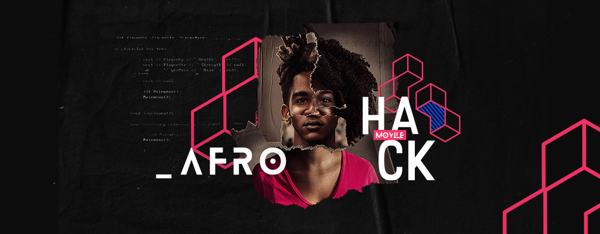

# Movile HACK-AFRO

Hackathon desenvolvido por pessoas negras, promovido pelo grupo MOVILE afim de viabilizar a "Educação/Desenvolvimento de jovens em situação de vulnerabilidade usando tecnologia."




## EDUCA **N**AÇÃO BACKEND API

## Iniciando o Projeto 

Para rodar o projeto, execute o comando abaixo:

```sh
docker-compose up -d
```

Após, acesse o browser na url: [http://localhost/app_dev.php/api/](http://localhost/app_dev.php/api/)

# Tecnologias Usadas

* Docker - [https://www.docker.com/](https://www.docker.com/)
* PHP 7 - [https://www.php.net/](https://www.php.net/)


### API Routes

Retorna todo conteúdo das trilhas para download mobile.
```bash
GET: /api/content

{
  "step-1": [
    {
      "title": "Ola title 1",
      "text": "Morbi dictum id eros sit amet mattis. Aliquam quis nulla mollis, feugiat ipsum ut, euismod mauris. Sed at condimentum diam. Cras eleifend neque eu tristique porttitor. Etiam non augue ex. Praesent at ultrices mauris. Orci varius natoque penatibus et magnis dis parturient montes, nascetur ridiculus mus."
    },
    {
      "image": "https://i.picsum.photos/id/99/200/300.jpg",
      "alt": "Lorem Ipsum"
    },
    {
      "audio": "http://kolber.github.io/audiojs/demos/mp3/juicy.mp3"
    }
  ],
  "step-2": [
    {
      "title": "Ola title 2",
      "text": "Morbi dictum id eros sit amet mattis. Aliquam quis nulla mollis, feugiat ipsum ut, euismod mauris. Sed at condimentum diam. Cras eleifend neque eu tristique porttitor. Etiam non augue ex. Praesent at ultrices mauris. Orci varius natoque penatibus et magnis dis parturient montes, nascetur ridiculus mus."
    },
    {
      "image": "https://i.picsum.photos/id/99/200/300.jpg",
      "alt": "Lorem Ipsum"
    },
    {
      "audio": "http://kolber.github.io/audiojs/demos/mp3/juicy.mp3"
    }
  ],
  "step-3": [
    {
      "title": "Ola title 3",
      "text": "Morbi dictum id eros sit amet mattis. Aliquam quis nulla mollis, feugiat ipsum ut, euismod mauris. Sed at condimentum diam. Cras eleifend neque eu tristique porttitor. Etiam non augue ex. Praesent at ultrices mauris. Orci varius natoque penatibus et magnis dis parturient montes, nascetur ridiculus mus."
    },
    {
      "image": "https://i.picsum.photos/id/99/200/300.jpg",
      "alt": "Lorem Ipsum"
    },
    {
      "audio": "http://kolber.github.io/audiojs/demos/mp3/juicy.mp3"
    }
  ],
  "step-4": [
    {
      "title": "Questionário",
      "text": "Morbi dictum id eros sit amet mattis. Aliquam quis nulla mollis, feugiat ipsum ut, euismod mauris. Sed at condimentum diam. Cras eleifend neque eu tristique porttitor. Etiam non augue ex. Praesent at ultrices mauris. Orci varius natoque penatibus et magnis dis parturient montes, nascetur ridiculus mus.",
      "answer-1": "resposta-1",
      "answer-2": "resposta-2",
      "answer-3": "resposta-3",
      "answer-4": "resposta-4"
    },
    {
      "image": "https://i.picsum.photos/id/99/200/300.jpg",
      "alt": "Lorem Ipsum"
    },
    {
      "audio": "http://kolber.github.io/audiojs/demos/mp3/juicy.mp3"
    }
  ]
}
```

Retorna audios dos conteúdos de trilhas.
```bash
GET: /api/audio

[
  {
    "step-1": "/audio/step-1.mp3",
    "title": "Lorem Ipsum"
  },
  {
    "step-2": "/audio/step-2.mp3",
    "title": "Lorem Ipsum"
  },
  {
    "step-3": "/audio/step-3.mp3",
    "title": "Lorem Ipsum"
  },
  {
    "step-4": "/audio/step-4.mp3",
    "tittle": "Lorem Ipsum"
  }
]

```

Retorna imagens das trilhas.
```bash
GET: /api/images

[
  {
    "step-1": "/images/step-1.png",
    "alt": "Lorem Ipsum"
  },
  {
    "step-2": "/images/step-2.png",
    "alt": "Lorem Ipsum"
  },
  {
    "step-3": "/images/step-3.png",
    "alt": "Lorem Ipsum"
  },
  {
    "step-4": "/images/step-4.png",
    "alt": "Lorem Ipsum"
  }
]

```